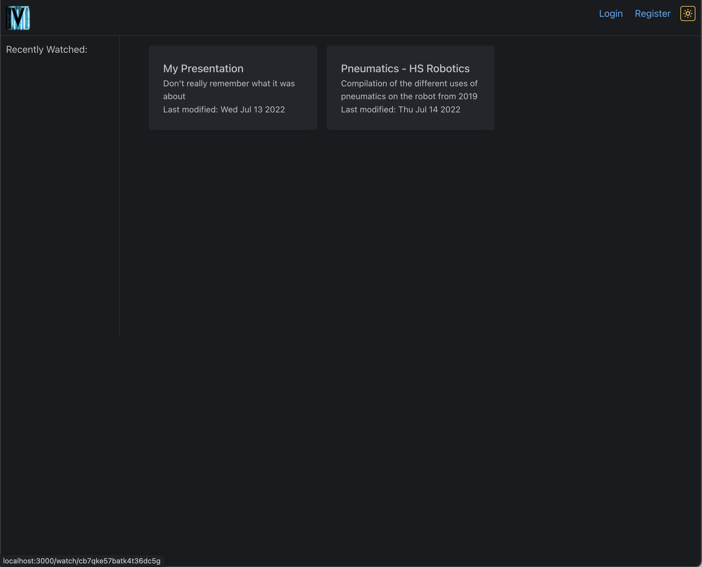
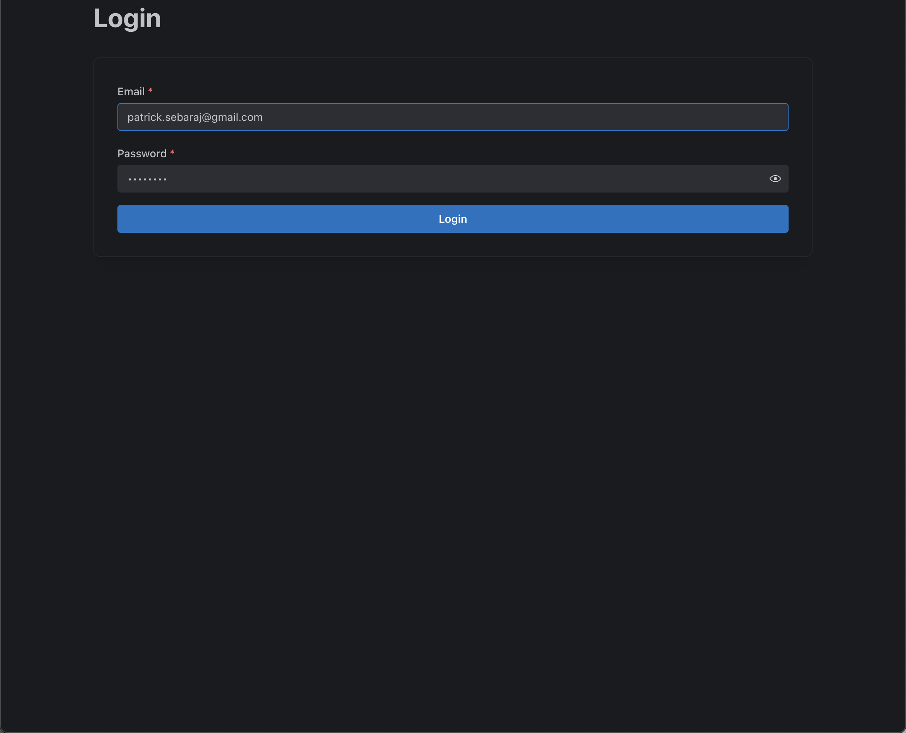
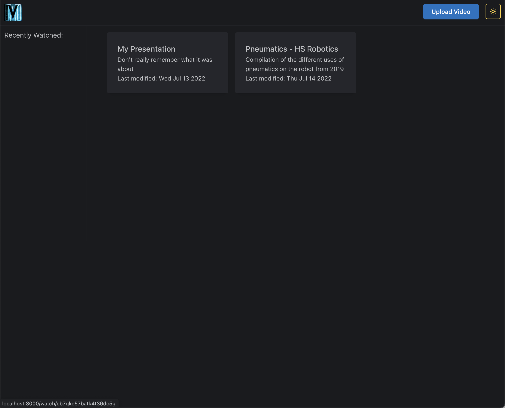
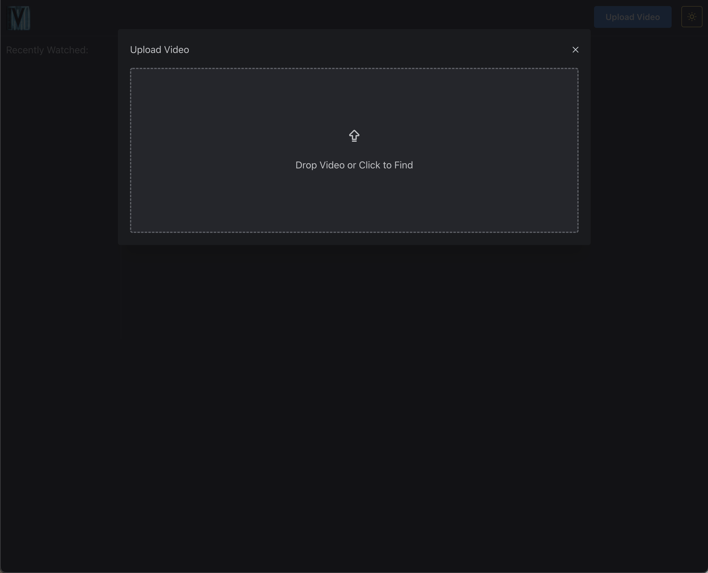
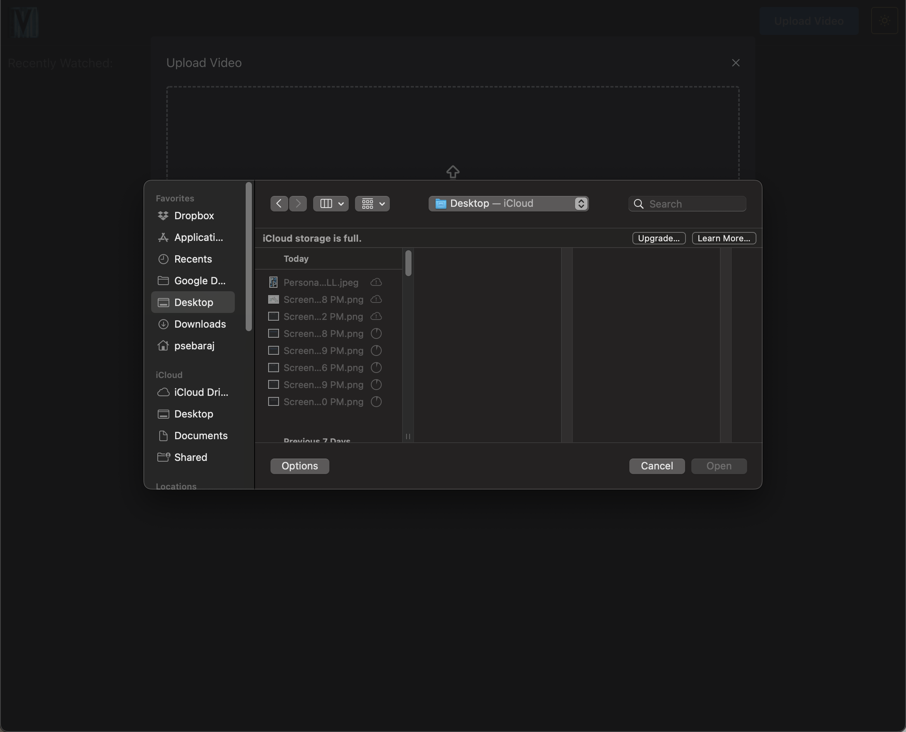
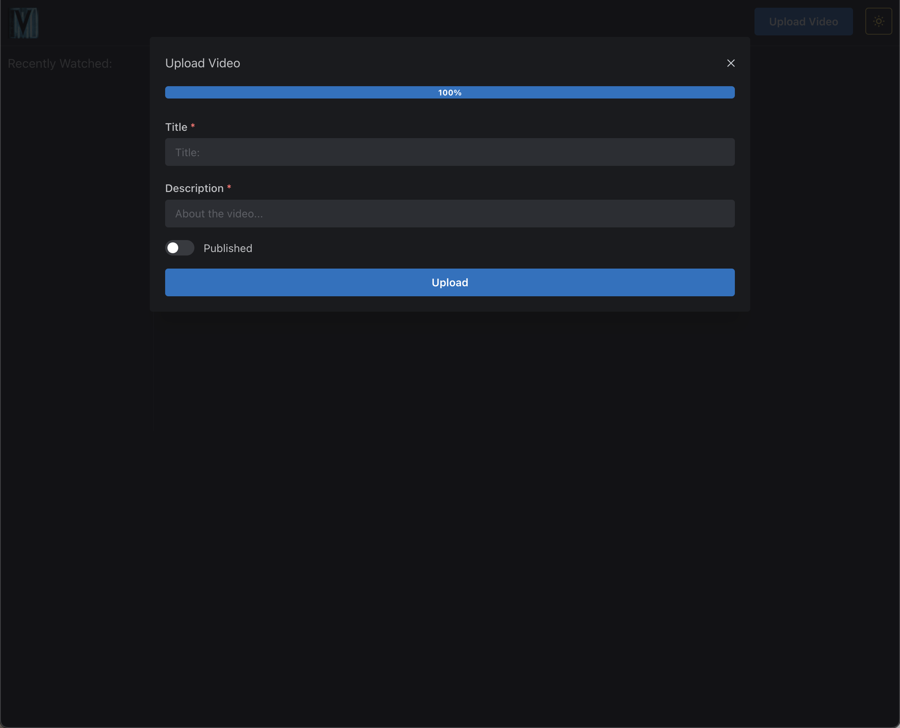
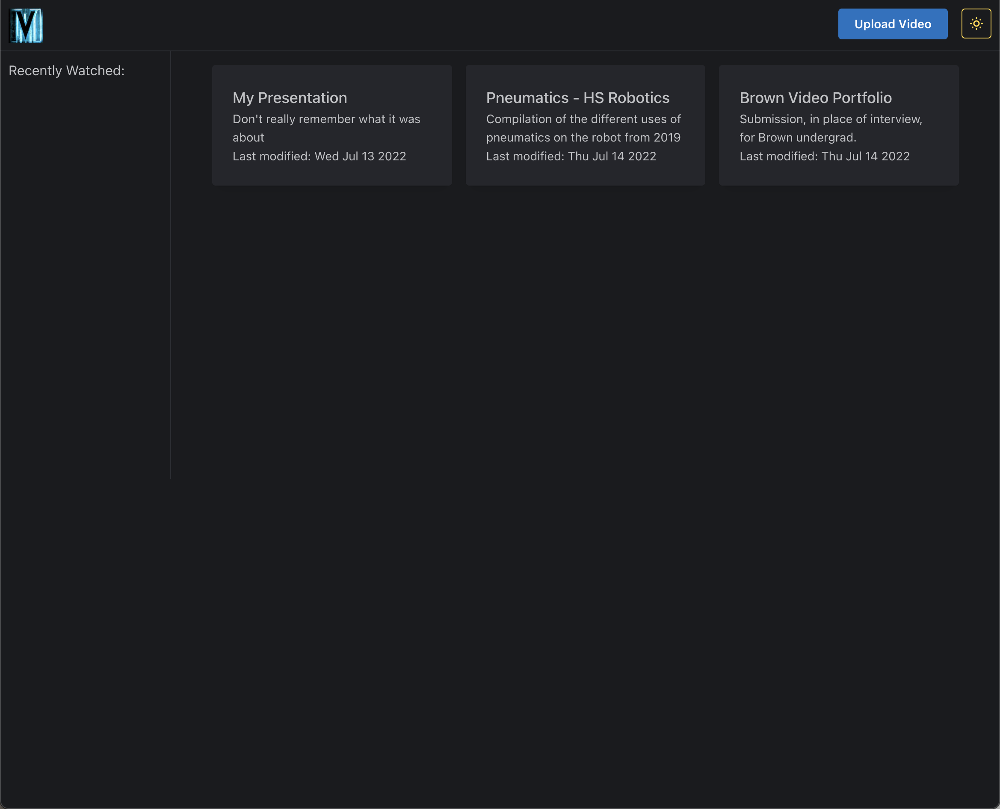
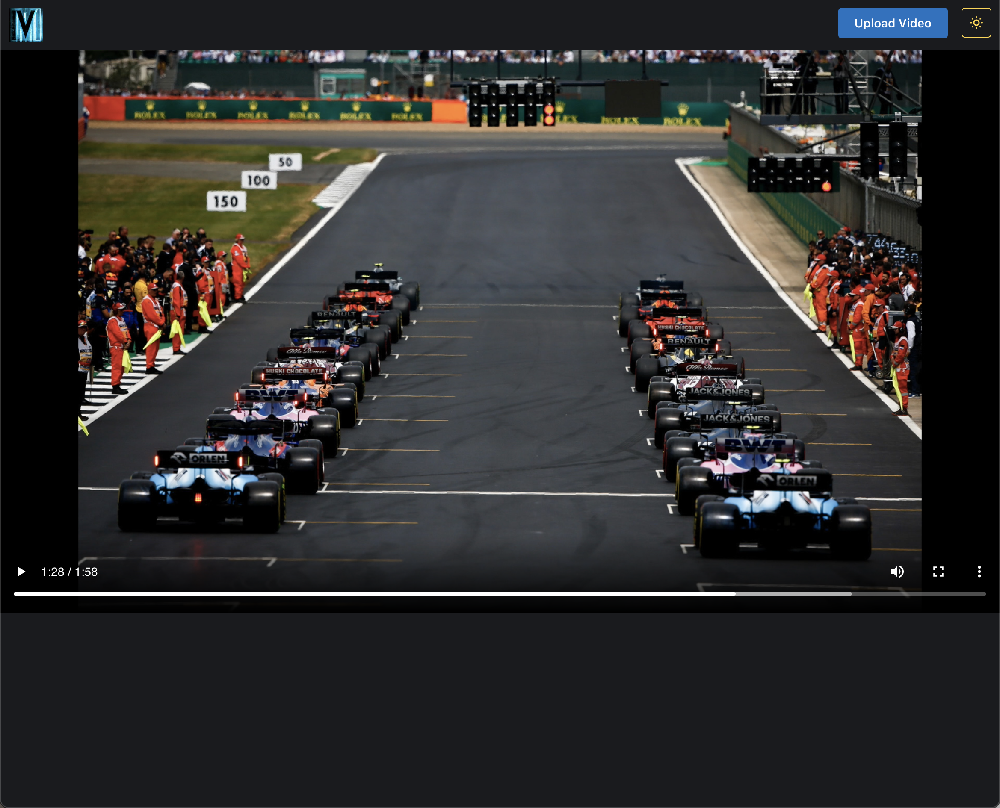
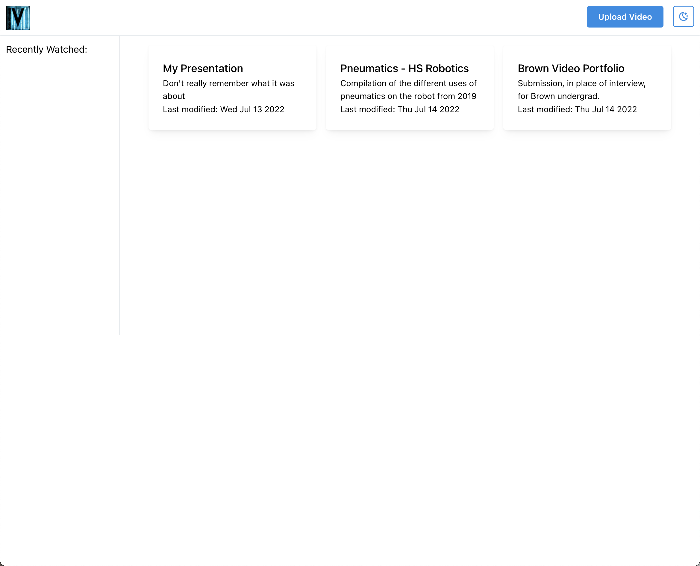
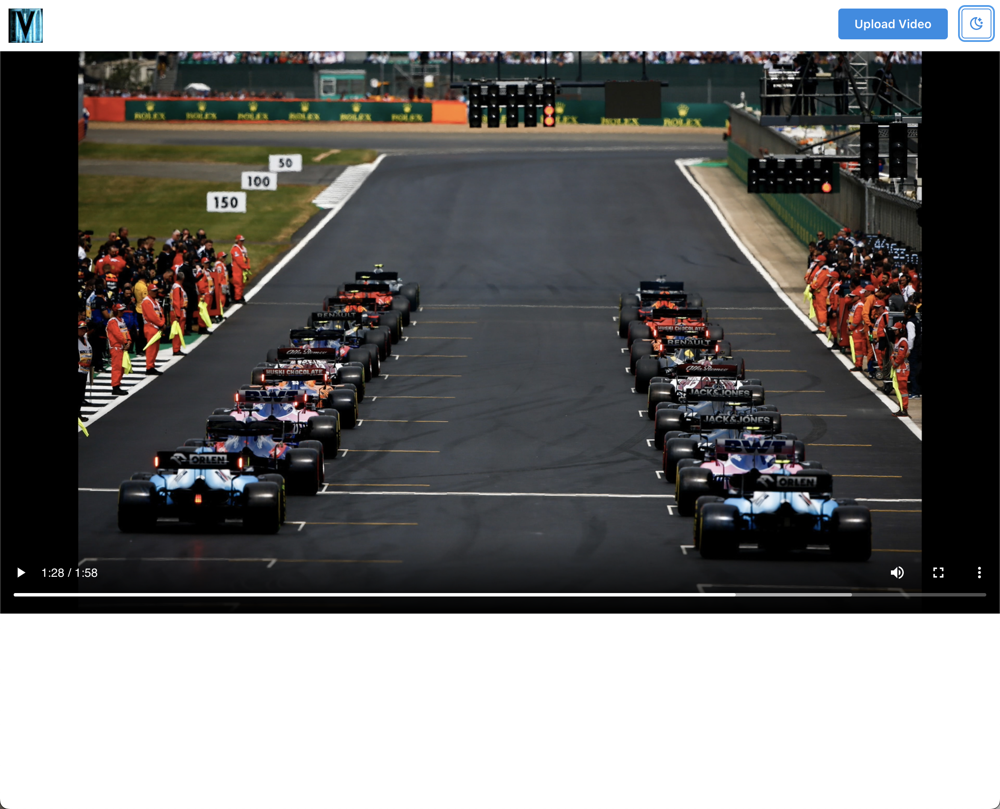

# Client for VideoMemories

Fontend of VideoMemories. Written in TypeScript.

## Dependencies
- [TypeScript](https://github.com/microsoft/TypeScript)
- [Next.js](https://github.com/vercel/next.js)
- [Mantine](https://github.com/mantinedev/mantine)

## UI
### In order of natural user flow

### Color Schemes (Light and Dark) permeate through elements

